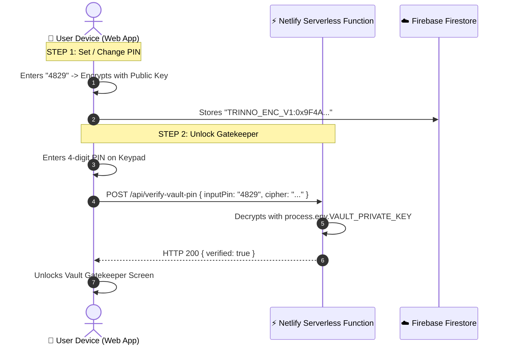

# 🔐 Cryptographic Vault PIN & Cloud Mediator Specification (Shelved Roadmap)

> **Status**: Shelved / Archived for future implementation  
> **Archived On**: September 1, 2026  
> **Goal**: Implement a zero-knowledge, asymmetric client-encrypt / server-decrypt 4-digit Vault PIN for private diary reflection lockouts without frontend key exposure.

---

## 🏛️ 1. Core Architecture Summary

### A. Frontend (Client Web App)
- **Role**: ONLY possesses the **RSA Public Key** (or Client Lock Padlock).
- **Operation**:
  1. User enters 4-digit PIN (e.g. `4829`).
  2. Frontend encrypts the PIN using the Public Key.
  3. Transmits the encrypted ciphertext `TRINNO_ENC_V1:0x9F4A...` to Firestore under `users/{uid}/settings/config.vaultPinCipher`.
  4. **Zero Decryption Code**: The frontend bundle has **0 lines of decryption code**, making it impossible to reverse from browser devtools or GitHub.

### B. Cloud Mediator (Netlify Serverless Functions)
- **Role**: Private execution runtime holding the **RSA Private Key** in environment secrets.
- **Location**: `netlify/functions/verify-vault-pin.js` (Free tier, 125,000 invocations/mo, 0 credit card needed).
- **Environment Variable**: `VAULT_PRIVATE_KEY` stored in Netlify Web Dashboard.
- **Operation**:
  1. Endpoint receives `{ uid, inputPin, targetCipher }`.
  2. Netlify Function deciphers `targetCipher` using `process.env.VAULT_PRIVATE_KEY` in memory.
  3. Compares `inputPin === decryptedPin`.
  4. Returns `{ success: true }` or `{ success: false }`.
  5. Memory is wiped immediately after execution.

---

## 🔄 2. Data Flow Diagram

---

## 🛡️ 3. Security Properties Guaranteed
1. **GitHub Immunity**: Even if the entire GitHub repository is open source, no one can decrypt user PINs because the Private Key is stored solely in Netlify's cloud environment.
2. **Device Loss Resilience**: If local browser storage or the user's PC is wiped, logging into Google automatically retrieves the encrypted cipher from Firestore.
3. **Database Breach Protection**: In Firestore, all user PINs sit encrypted. No plain text numbers exist in the database.

---

## 🚀 4. Implementation Steps When Ready to Resume
1. Create `netlify/functions/verify-vault-pin.js`.
2. Generate an RSA Keypair via `crypto.generateKeyPairSync('rsa', { modulusLength: 2048 })`.
3. Add `VAULT_PRIVATE_KEY` to Netlify environment variables.
4. Integrate the Public Key into `src/services/cipherEngine.js` for client-side encryption.
5. Re-enable `<VaultPinSettings />` in `SettingsModal.jsx` and `VaultLockGatekeeper` in `App.jsx`.
